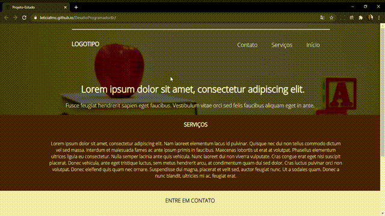

### A Landing Page foi criada para estudo e treinamentos das habilidades em css e html.

- Funciona em todos os tipos de telas.
- Css
- Html

### Instalação 

Clone este repositório usando git clone https://github.com/Leticiafrnc/DesafioProgramadorBr.git ou clique em Code/Download ZIP.
Clique no arquivo "index.HTML" e veja a aplicação.

### Observação: Se abrir a aplicação no celular, tablet ou qualquer tipo de tela a aplicação se adapta.
